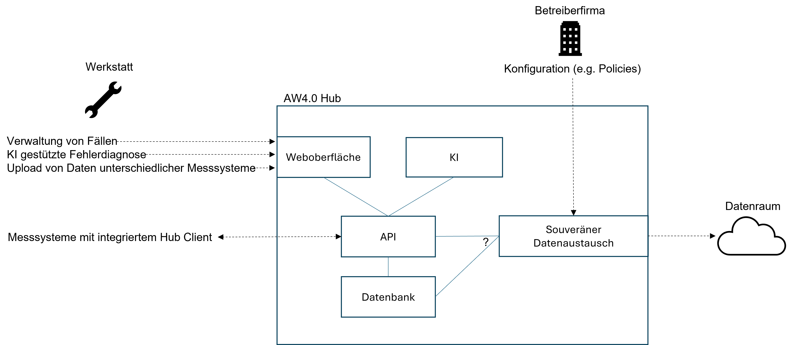

# Hintergrund

Im Projekt gibt es drei Hauptthemen:

- Innovative Messtechnik
- KI gestützte Fehlerdiagnose
- Gaia-X

Im Rahmen der 2022 durchgeführten Arbeiten und Gespräche wurden verschiedene 
Anforderungen in diesen Bereichen identifiziert, also Aufgaben / Probleme, 
die durch das **System Autowerkstatt 4.0** gelöst werden sollen.

Diese werden im folgenden Abschnitt [Anforderungsanalyse](#anforderungsanalyse) 
genauer beschrieben.
Darauf aufbauend wird im Abschnitt [Lösungsansatz](#losungsansatz) eine Übersicht 
des AW4.0 Hub präsentiert.

## Anforderungsanalyse

Im AW4.0 Universum gibt es verschiedene *Rollen*, also Benutzer- / Anwenderebenen
die mit dem System interagieren. Diese sind:

- Werkstatt
- Betreiberfirma
- Datenraum
- Fahrzeug
- Messsystem

Diese Rollen sind mit ihren jeweiligen Beziehungen im untenstehenden Diagramm dargestellt.

Aufbauend auf diesen Überlegungen zur Struktur des AW4.0 Universums lassen sich 
vielfältige Anforderungen identifizieren, also konkrete Funktionalitäten, die das 
System haben soll. Diese werden im Folgenden beschrieben.

Neben der Durchführung von Messungen muss im Umfeld der Werkstatt ein einfaches 
*Datenmanagement* vorausgesetzt werden.
Es sollte dabei möglich sein, neue "Fälle" anzulegen, wenn ein Auto in die Werkstatt kommt.
Diese Fälle sollten z.B. bearbeitet, durchsucht und gelöscht werden können.

Mitarbeiter in Werkstätten sollten außerdem die Möglichkeit haben, KI unterstützte
Fehlerdiagnose durchzuführen, also die am DFKI entwickelte State Machine anzuwenden.
Dabei soll die Integration gängiger Messsysteme von verschiedenen Herstellern 
berücksichtigt werden, d.h. es sollte möglich sein, die Daten unterschiedlicher Messsysteme
zu einem Fall hinzuzufügen, damit diese von der KI verwertet werden können.

Autowerkstatt 4.0 soll außerdem Anforderungen auf der höher gelagerten Ebene der 
Betreiberfirma erfüllen. Hier sollte es möglich sein, die eigenen Geschäftsdaten sicher zu 
verwalten, wobei insbesondere der Schutz personenbezogener Informationen von Mitarbeitern
und Kunden sicherzustellen ist.

Eine weitere Anforderung im Umfeld der Betreiberfirma ist die *Teilnahme am AW4.0 
Datenraum*, also insbesondere:

- Selbstbestimmtes Teilen der Geschäftsdaten mit externen Partnern (e.g. für F&E)
- Datensouveränität: Konfiguration von Policies, um die Weitergabe und Weiterverwendung 
durch externe Partner zu regulieren
- Shopping im Datenraum, z.B. Einkauf von KI Lösungen

## Lösungsansatz

Das auf dieser Website beschriebene System ist ein Prototyp für den *Autowerkstatt 4.0
Hub*. Dieser ist ein IT-System, mit dem die im vorherigen Abschnitt beschriebenen 
Anforderungen erfüllt werden sollen. 

Die wichtigsten Ideen sind:

*Eine Betreiberfirma hat einen AW4.0 Hub.*

- Dieser ist ein Firmen-eigenes IT-System, auf dem nur die eigenen Geschäftsdaten verwaltet
werden.
- Nur die eigenen Mitarbeiter (in Werkstätten oder Zentrale) interagieren mit diesem
System.

*Ein Hub besteht aus verschiedenen Services / Komponenten.*

- Diese stellen für die Mitarbeiter in den Werkstätten die benötigten Funktionalitäten 
zur Verwaltung von Fällen und zur KI gestützten Fehlerdiagnose bereit.
- Weitere Services ermöglichen der Betreiberfirma die selbstbestimmte Verwaltung und 
Weitergabe der eigenen Geschäftsdaten.

Damit ist der Hub wie in der folgenden Abbildung dargestellt in das AW4.0 Universum 
einzuordnen:

Im Gegensatz zu früheren Ideen gibt es im AW4.0 Universum also hier nicht *eine 
Datenpipeline* und *einen Server*. Dieses Grundgerüst erscheint nicht sinnvoll, da die
selbstbestimmte Verwaltung und Weitergabe der eigenen Geschäftsdaten eine essenzielle
Anforderung an das System ist.

Weitere Kernaspekte des AW4.0 Hubs sind:

*Separation of Concerns*

- Messsysteme mit denen Daten am Fahrzeug generiert werden, sind nicht Teil des Hubs. Die 
Interfaces des Hubs sind jedoch so gestaltet, dass die Integration verschiedener 
Messsysteme gewährleistet ist.
- KI (e.g. die State Machine) wird auf dem Hub ausgeführt und nicht auf einem Messgerät,
da dies die Integration verschiedener propriäterer Messsysteme deutlich erschweren würde.

*Flexible Interaktionsmöglichkeiten*

- Über eine Weboberfläche können die Fälle der eigenen Werkstatt eingesehen und verwaltet 
werden sowie Daten unterschiedlicher Messsysteme
hochgeladen werden.
- Alternativ können spezialisierter Messsysteme direkt über eine API mit dem Hub 
kommunizieren.

*Flexible physische Ausgestaltung*

- On-premise vs. Cloud
- Single-host vs. Verteiltes System

Die folgende Abbildung zeigt eine Architektur Skizze des Hub Prototypen:

**Anmerkungen**

Es gibt noch weitere Anforderungen und daraus abgeleitete Services, die hier nicht 
dargestellt wurden, aber berücksichtigt werden müssen. Dazu zählt beispielsweise die 
Anforderung *Authentifizierung und Autorisierung*.

Die Architekturskizze soll nur eine Grundidee basierend auf den vorgestellten Rollen und 
Anforderungen illustrieren.

Alle Komponenten in der Skizze erfordern weitere spezifische Anforderungsanalysen und 
daraus abgeleitete Designs. Insbesondere die Komponenten *KI* und
*souveräner Datenaustausch* setzen sich wiederum aus mehreren Services zusammensetzen.